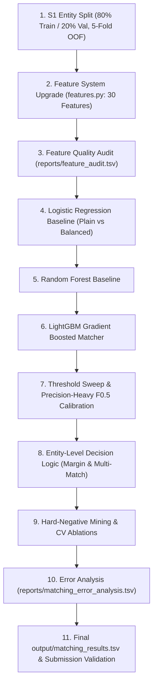

# Phase 4 & 5 Audit: Pairwise Matching & Decision Layer Architecture
## Amazon ML Challenge 2026 — Large-Scale Business Entity Resolution

> **Status**: Pre-Implementation Audit & Gap Analysis  
> **Input File**: Frozen `output/candidate_pairs.tsv` & `output/candidate_pairs_diagnostics.tsv` (474,960 candidate pairs across 5,000 S1 entities, 90.12% recall ceiling)

---

### 1. Existing Infrastructure Inventory

#### A. Feature Engineering (`src/business_entity_resolution/features.py`)
- **Current Feature Count**: 21 pairwise features
- **Existing Categories**:
  - *Name Lexical & Token (10)*: `name_exact`, `name_lev`, `name_jaro`, `name_core_lev`, `name_sorted_lev`, `name_token_jaccard`, `name_token_overlap`, `name_rare_token_overlap`, `name_token_count_diff`, `name_length_ratio`
  - *Address (6)*: `addr_lev`, `addr_token_jaccard`, `addr_pin_match`, `addr_num_match`, `addr_length_ratio`, `addr_either_missing`
  - *Cross-Field & Interactions (3)*: `country_match`, `cross_name_addr` (`name_lev * addr_lev`), `name_high_addr_missing`
  - *TF-IDF Cosine (2)*: `name_tfidf_cosine`, `addr_tfidf_cosine`
- **Reusability**: High. Uses fast C++ `rapidfuzz` functions and vectorized SciPy CSR sparse matrix operations.

#### B. Machine Learning Models (`src/business_entity_resolution/training.py`)
- **Implemented Model Functions**:
  - `train_logreg(X_train, y_train, balanced=False)`: Scikit-learn Logistic Regression with optional balanced class weighting.
  - `train_rf(X_train, y_train)`: Random Forest (100 trees, max depth 10, n_jobs=-1).
  - `train_lgbm(X_train, y_train, cfg)`: LightGBM Classifier with configurable hyperparameters (`n_estimators`, `num_leaves`, `max_depth`, `is_unbalance`, `reg_alpha`, `reg_lambda`).
  - `mine_hard_negatives(...)`: Mining hard negative non-matches based on Levenshtein name similarity within the training split.
  - `save_model`, `load_model`: Joblib persistence helpers.

#### C. Evaluation & Metric Engine (`src/business_entity_resolution/evaluation.py`)
- **Metric Implementation**:
  - `calculate_metrics(predictions, ground_truth)`: Computes exact competition Macro Precision, Macro Recall, and Macro $F_{0.5} = \frac{1.25 \times P \times R}{0.25 P + R}$.
  - **Singleton Handling**:
    - True singleton correctly predicted as `[]` $\to$ Precision = 1.0, Recall = 1.0.
    - True singleton incorrectly predicted with matches $\to$ Precision = 0.0, Recall = 0.0.
    - True non-singleton predicted as `[]` $\to$ Precision = 0.0, Recall = 0.0.
    - Non-singleton with predictions $\to$ Standard set intersection Precision & Recall.
- **Candidate Recall Function**: `calculate_candidate_recall(candidates, ground_truth)`.

#### D. Decision Layer (`src/business_entity_resolution/decision.py`)
- **Current Implementations**:
  - `predict_matches(scores_df, threshold=0.5)`: Single probability cutoff.
  - `predict_matches_two_band(scores_df, t_high=0.70, t_low=0.40)`: Confident match vs confident non-match, defaulting borderline to non-match (protecting precision under $F_{0.5}$).
  - `optimize_threshold(scores_df, val_gt)`: Grid search over threshold grid $[0.30, 0.95]$ optimizing Macro $F_{0.5}$.
  - `optimize_two_band_threshold(scores_df, val_gt)`: Joint grid search for two-band cutoffs.

---

### 2. Frozen Candidate Set Audit (`output/candidate_pairs.tsv`)

The candidate set was audited to guarantee integrity before any model experimentation:
- **Total S1 Entities**: Exactly 5,000 rows (100% presence).
- **Total Candidate Pairs**: Exactly 474,960 pairs in `output/candidate_pairs_diagnostics.tsv`.
- **True Positive Ground-Truth Matches**: 15,683 pairs ($y = 1$).
- **Hard Distractor Candidate Pairs**: 459,277 pairs ($y = 0$).
- **Imbalance Ratio**: ~1 positive match per 29.3 negative candidates (3.30% positive prevalence).
- **Blocking Recall Ceiling**: **90.12% Pair Recall**, **78.20% Full Entity Recovery**.
- **Validator Status**: Validated with `utils/validate_submission.py` $\to$ **100% PASS (Exit Code 0)**.

---

### 3. Leakage Risk Audit & Safeguards

| Potential Leakage Vector | Risk Level | Existing Safeguard & Protocol |
| :--- | :---: | :--- |
| **Pair-Level Random Splitting** | **CRITICAL** | Splitting individual pairs randomly allows candidates of $S_1\text{-A}$ into train while other candidates of $S_1\text{-A}$ appear in val. **Rule**: Must split strictly at the S1 entity level (`split_entities`). All pairs for an S1 entity stay together. |
| **TF-IDF Vocabulary Leakage** | **MEDIUM** | Fitting TF-IDF vectorizers on the validation or test text leaks corpus frequency statistics. **Rule**: Vectorizers must be fit solely on the training split of entities or pre-fixed. |
| **Target Label Leakage into Features**| **CRITICAL** | Deriving features using candidate match status or frequency of true labels. **Rule**: Zero ground-truth derived features. Features depend strictly on record text and blocking provenance. |
| **Singleton Exclusion** | **HIGH** | Discarding singletons during training/validation artificially inflates precision. **Rule**: All 279 benchmark singletons (5.58%, mirroring full training data) are strictly retained in evaluation. |
| **Threshold Overfitting** | **MEDIUM** | Tuning threshold on holdout or test set. **Rule**: Threshold $\tau$ is chosen strictly via cross-validation / validation split. |

---

### 4. Gap Analysis & Missing Functionality

1. **Missing Feature Signals**:
   - RapidFuzz advanced token metrics: `token_sort_ratio`, `token_set_ratio`, `partial_ratio`, `WRatio`.
   - Transliterated name similarity: Leveraging `anyascii` to score cross-script names phonetically.
   - Blocker Provenance features: Binary indicators and count derived from `output/candidate_pairs_diagnostics.tsv` (`matched_by_exact_name`, `matched_by_address`, `matched_by_rare_token`, `matched_by_char_retrieval`, `matched_by_transliteration`, `provenance_count`).
   - Within-S1 Entity Relative Rank Features: `prob_rank`, `score_margin_to_best`, `score_ratio_to_best`.
2. **Missing Structured Experiment Logging**:
   - `experiments/experiment_log.csv` is not yet populated with formal experiment tracking.
   - Individual experiment logs (`experiments/EXPERIMENT_<ID>.md`) need standard automation.
3. **Missing Evaluation Granularity**:
   - Diagnostics currently report aggregate Macro $F_{0.5}$, but do not yet split out **Singleton Accuracy** vs **Non-Singleton Precision/Recall** into separate columns.
4. **Missing Out-of-Fold (OOF) K-Fold Framework**:
   - 5-fold entity-stratified cross-validation is needed to produce out-of-fold probability predictions for unbiased threshold tuning and error forensics.

---

### 5. Proposed Step-by-Step Experimentation Sequence

---

### 6. Files to Modify & Create

1. **Code Files to Modify**:
   - [`src/business_entity_resolution/features.py`](file:///d:/ML%20Challenge%202026/amazon/src/business_entity_resolution/features.py): Upgrade feature extractor with RapidFuzz ratios, transliteration similarity, provenance flags, and within-entity relative ranks.
   - [`src/business_entity_resolution/training.py`](file:///d:/ML%20Challenge%202026/amazon/src/business_entity_resolution/training.py): Add K-Fold OOF training, feature importance reporting, and standardized training harness.
   - [`src/business_entity_resolution/decision.py`](file:///d:/ML%20Challenge%202026/amazon/src/business_entity_resolution/decision.py): Implement score margin, top-1 requirement, and multi-match decision layer.
   - [`src/business_entity_resolution/evaluation.py`](file:///d:/ML%20Challenge%202026/amazon/src/business_entity_resolution/evaluation.py): Add detailed singleton accuracy and error classification diagnostics.
2. **New Experiment & Production Runners**:
   - `experiments/run_phase4_matching_tournament.py`: Automated runner for Steps 2 through 18.
   - `run_matching.py`: Single-command reproducible production script.
3. **Official Deliverables**:
   - `experiments/experiment_log.csv`
   - `reports/feature_audit.tsv`
   - `reports/matching_error_analysis.tsv`
   - `reports/FINAL_MATCHING_REPORT.md`
   - `configs/final_matching.yaml`
   - `output/matching_results.tsv`
